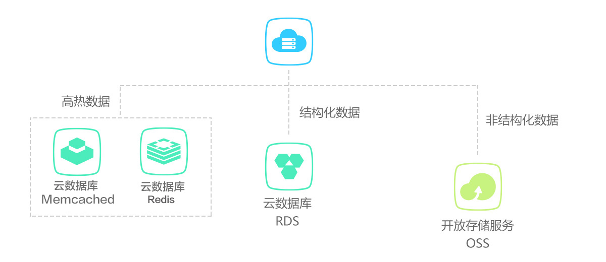
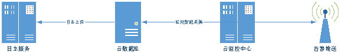

# 基本信息

##测试1
* * 产品分类：数据库
* 中文名：云数据库
* 英文名：RDS
* 产品简介（一句话介绍产品，1~30个字符，将展示在首页）：*稳定托管、全面监控*、自动运维的关系型数据库服务
* 产品描述（对产品进行描述，1~128个字符）：云数据库（**RDS**）是一种稳定可靠的***在线数据库服务***，基于兼容MySQL的Mariadb开源数据库，它可以即开即用、弹性伸缩、轻松管理，支持单机、主备或`集群部署`模式。彻底解决数据库运维的困扰，让您能更加专注于业务发展。
##测试2
缩短开发斯蒂芬vhsdfg速度

# 产品概述

云数据库（RDS）是一种稳定可靠的在线数据库服务，基于兼容MySQL的Mariadb开源数据库，默认部署主备架构，且提供了备份、监控、容灾、扩容等方面的完整解决方案。

| 优势     | 云数据库 RDS                                 | 自建数据库                                    |
| ------ | ---------------------------------------- | :--------------------------------------- |
| 价格优势   | **成本最优**：您无需预先采购、准备硬件资源及投入数据库研发，云数据库提供多种具有成本优势的存储介质供您选择，帮助您有效降低数据库基础设施的投入。 | **费用高昂**：硬件方面，单台存储服务器成本高（如果搭建主从，需要购买2台，保证资源冗余）。软件方面，需要招聘专业 DBA，人力成本高。 |
| 高性能    | **专项内核优化**：优化 MySQL 内核，消除冗余 I/O、缩短 I/O 路径，规避了大锁竞争，性能超过基于开源 MySQL 的自建数据库。云数据库RDS的性能优势让您可以以更少的数据库数量支撑更高的业务并发请求量，简化了后端架构，使得整体 IT 架构更易于管理和运维。 | **调优水平无法保证**：数据库性能依赖技术人员的调优水平。           |
| 服务高可用性 | **多重保障**：实时双机热备，故障秒级切换。让您仅需极少的工作就能够轻松实现高可用的数据库架构，为业务高速发展提供稳定的基础设施。 | **可用性低**：需自行处理故障、自建主从、自建 RAID、自建灾备。      |
| 数据高可靠性 | **完善的保障机制**：拥有完善的数据自动备份，包括实时双机热备，三日内冷备数据 dump。云数据库RDS 的高可靠性让您可以放心将数据放在云端，无需担心数据丢失，同时简化了传统运维工作中为保障数据高可靠带来的额外工作量和 IT 投入成本。 | **保障体系不周全**：自行保障，依赖硬件的故障发生率，依赖技术人员的数据库管理水平。 |
| 全面监控   | **一体化监控**：提供包含二十项重要指标的专业数据库多维度监控，支持故障自定义预警，让您可以随时深入了解数据库实例的运行状况，对故障实现自动告警，数据库运维更加省心。 | **监控体系不健全**：需自行开发数据库监控系统，运维人员需半夜处理故障。    |
| 自动化运维  | **全流程运维服务**：您无需关心RDS的安装、部署、版本更新及故障处理，免除后顾之忧。主备切换和故障的处理，对用户完全透明，帮助您极大程度降低运维成本。 | **工作繁琐**：用户需独立负责 数据库的安装、部署、版本更新、故障处理等操作。主备切换时，用户需要重新配置数据据库连接。 |

# 应用场景

## 多结构数据存储

在数据类型多样的应用中，可将高热存取数据存储于缓存产品，如缓存服务Redis，将图片等非结构化资源存储于对象存储OSS，而将结构化数据存储于RDS，实现对业务数据高效存取，并相应降低成本投入。

## 监控、日志、告警一体化

云数据库的日志、监控信息支持被云监控中心和日志服务自动采集，并在达到阈值时自动触发告警。

